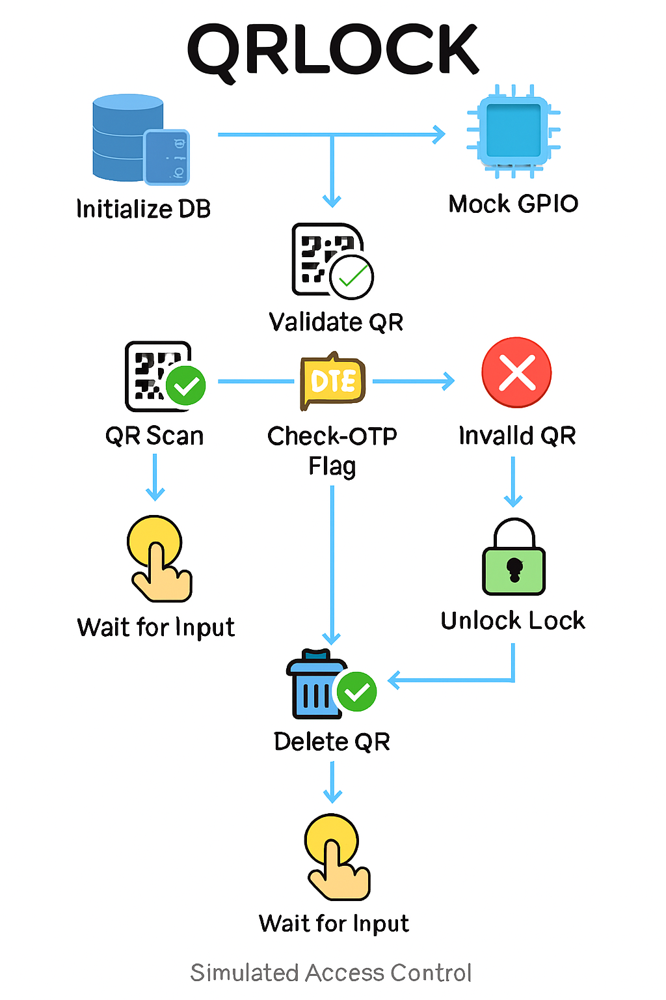
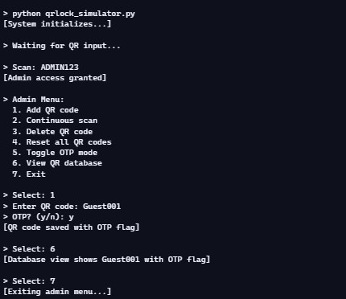

# 📽️ QRLOCK Presentation – Simulated Smart Access Control

---

## 🎯 Slide 1: QRLock access

**QRLOCK – Simulated Smart Access Control System**

> Powered by Raspberry Pi, Python, SQLite, and AI

---

## ❓ Slide 2: Problem Statement

**Why Simulate Access Control?**

- Many dev/test setups lack GPIO hardware  
- Need for secure, testable access logic  
- QRLOCK simulates smart lock behavior in terminal  

🗣️ Speaker Notes

“In hardware-constrained environments, QRLOCK offers a safe and testable way to simulate access control logic using QR codes and terminal prompts.”

---

## 🧠 Slide 3: System Overview

**QRLOCK Architecture**

> 🧩 A playful, icon-driven flowchart showing how QRLOCK handles input, validation, OTP logic, and simulated lock control.

🗣️ Speaker Notes

“This flow shows how QR input triggers validation, OTP logic, and simulated lock control—all backed by a SQLite database.”

---

## 🔧 Slide 4: Key Features

| Feature             | Description                                 |
|---------------------|---------------------------------------------|
| ✅ Simulated GPIO    | Lock + button control via terminal          |
| 🔐 OTP Support       | One-time QR codes auto-delete               |
| 🧑‍💼 Admin Menu       | Add/delete/reset QR codes                   |
| 📋 SQLite DB         | Timestamped QR entries                      |
| 🧪 Terminal UI       | Fully simulated interactions                |

🗣️ Speaker Notes

“QRLOCK is modular, auditable, and designed for clarity—perfect for reviewers and learners alike.”

---

## 🎥 Slide 5: Demo Preview

> 🎬 Admin menu in action: adding QR codes, toggling OTP, and viewing the database—all in a light-themed terminal.

🗣️ Speaker Notes

“Here’s a quick walkthrough: scanning a QR code, unlocking the lock, and accessing admin controls—all simulated.”

---

## 🧑‍💼 Slide 6: Admin Menu

**Admin Options**

| Option | Action                          |
|--------|----------------------------------|
| 1      | Add QR (OTP optional)           |
| 2      | Continuous scan                 |
| 3      | Delete QR                       |
| 4      | Reset DB                        |
| 5      | Toggle OTP                      |
| 6      | View DB                         |
| 7      | Exit                            |

🗣️ Speaker Notes

“The admin menu is intuitive and modular—each option updates the database with traceable actions.”

---

## 🔁 Slide 7: OTP Use Case

**One-Time Passcode Logic**

- QR code flagged as OTP  
- Deleted after successful scan  
- Ideal for guest or delivery access  

🗣️ Speaker Notes

“OTP codes offer temporary access—once used, they’re removed from the database for security.”

---

## 🧱 Slide 8: Design Philosophy

**Built for Reviewers**

- Modular functions  
- Audit-friendly DB schema  
- Clear terminal feedback  
- Future-proof structure  

🗣️ Speaker Notes

“QRLOCK is designed with traceability in mind—every decision is logged, every module is cleanly separated.”

---

## 🚀 Slide 9: Future Extensions

**What’s Next?**

- Real GPIO integration  
- Web dashboard  
- Cloud sync  
- Mobile QR scanner  

🗣️ Speaker Notes

“QRLOCK can evolve into a full hardware deployment with web UI and mobile integration.”

---

## 📞 Slide 10: Product presentation pdf

**Reference with raspberry pi and other QR products**

- Demo PDF: [`TANG SEONG FATT - QRLOCK.pdf`](TANG%20SEONG%20FATT%20-%20QRLOCK.pdf)  

🗣️ Speaker Notes

“Feel free to fork the repo, run the simulator, or reach out for collaboration!”

